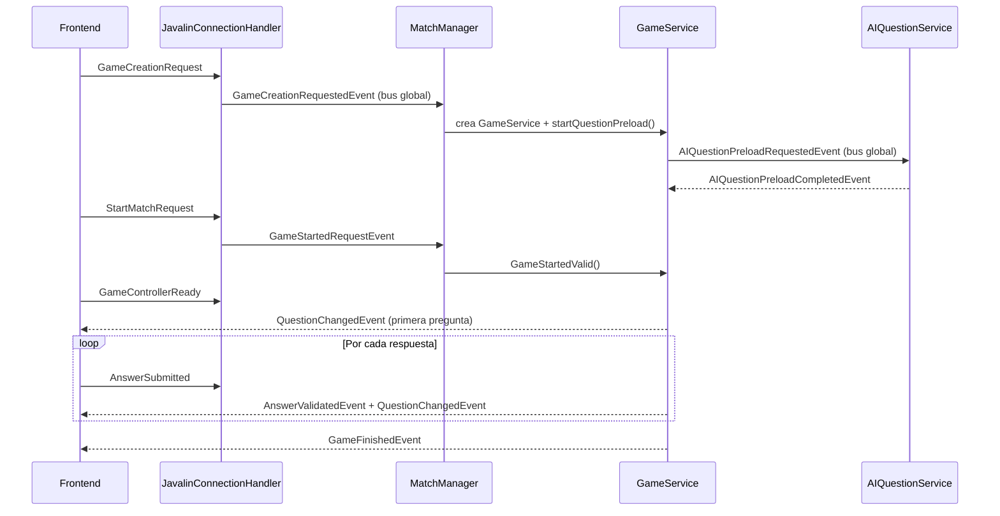

# Arquitectura y Funcionamiento de Apalabrazos

## Descripción General

Apalabrazos es un juego multijugador en tiempo real de tipo "rosco". Los jugadores responden preguntas asociadas a cada letra del alfabeto compitiendo contra el tiempo. El backend es Java + Javalin con WebSockets; el frontend es Phaser.js servido por el propio backend.

---

## Stack tecnológico

| Componente | Tecnología | Versión |
|---|---|---|
| Backend | Java + Javalin | 21 / 7.2.0 |
| Frontend | Phaser.js | 3.x |
| Base de datos | Azure Cosmos DB SDK | 4.80.0 |
| Autenticación | Auth0 java-jwt | 4.4.0 |
| Serialización | Jackson | 2.18.7 |
| Logging | SLF4J + Logback | 2.0.13 / 1.5.25 |
| Tests | JUnit 5 | 5.9.2 |
| Contenedor | Docker (multi-stage build) | — |

---

## Arquitectura del Sistema

### Capas principales

```
┌────────────────────────────────────────────┐
│  Browser — Phaser.js                        │
│  (HTML + JS servido desde /public)          │
└──────────────────┬─────────────────────────┘
                   │ WebSocket /ws/{userId}
┌──────────────────▼─────────────────────────┐
│  Backend — Javalin (puerto 8080)            │
│                                             │
│  JavalinConnectionHandler                  │
│        │  GlobalAsyncEventBus              │
│  MatchManager ── GameService               │
│                      │                     │
│               AIQuestionService            │
└──────────────────────┬──────────────────────┘
                       │
        ┌──────────────┴───────────┐
        │ Azure Cosmos DB          │ LLM API
        │ (usuarios, preguntas)    │ (Ollama / OpenRouter)
        └──────────────────────────┘
```

### 1. Frontend (Phaser.js)

**Estructura relevante:**
- `public/index.html` — shell HTML con todas las vistas (login, lobby, juego)
- `public/js/main.js` — punto de entrada
- `public/js/network/socket-client.js` — cliente WebSocket
- `public/js/network/message-handler.js` — despacho de mensajes entrantes
- `public/js/phaser_src/scenes/MainScene.js` — escena principal del juego
- `public/js/phaser_src/ui/` — componentes visuales del rosco, pregunta, scoreboard

### 2. Backend — Componentes principales

#### Red
- **`EmbeddedWebSocketServer`** — arranca Javalin y registra las rutas WebSocket y HTTP
- **`JavalinConnectionHandler`** — parsea mensajes JSON entrantes y los despacha como eventos al `GlobalAsyncEventBus`
- **`ConnectionRegistry`** — mantiene el mapa `sessionId → Player` con el canal de salida WebSocket

#### Bus de eventos
- **`GlobalAsyncEventBus`** — bus global asíncrono; columna vertebral de comunicación interna
- **`AsyncEventBus`** — bus local por partida (entre `GameService` y su bridge en `MatchManager`)
- **`GlobalBusEventCatalog`** — catálogo declarativo de qué eventos circulan por el bus global, quién los emite y quién los consume

#### Servicios
- **`MatchManager`** — singleton que gestiona todas las partidas activas (`matchId → GameService`), enruta eventos de red y hace de bridge entre `GameService` y los clientes WebSocket
- **`GameService`** — lógica de negocio de una partida concreta: máquina de estados, respuestas, puntuación, timer
- **`AIQuestionService`** — genera preguntas vía LLM de forma asíncrona; escucha `AIQuestionPreloadRequestedEvent` y responde con `AIQuestionPreloadCompletedEvent` o `AIQuestionPreloadFailedEvent`
- **`TimeService`** — publica `TimerTickEvent` cada segundo al bus global

#### Configuración
- **`CosmosDBConfig`** — conexión a Azure Cosmos DB leída de variables de entorno
- **`JwtConfig`** — secreto, issuer, audience y expiración del token JWT
- **`AIQuestionConfig`** — todos los parámetros del generador de preguntas (URL, modelo, tokens, etc.)

#### Modelos de dominio
- **`GameGlobal`** — estado global de una partida (máquina de estados, jugadores, timer)
- **`GameInstance`** — estado individual de un jugador dentro de la partida
- **`QuestionList` / `Question`** — preguntas y estado de respuesta por jugador
- **`Player`** — jugador con su canal de envío WebSocket
- **`GameRecord`** — resultado final de un jugador

### 3. Capa de datos

- **Azure Cosmos DB** — usuarios y persistencia de preguntas generadas
- **JSON local** — seed de preguntas de arranque (`questions2.json`)

---

## Flujo de una partida



---

## Sistema de eventos

Ningún componente llama directamente a otro. Toda la comunicación fluye a través de eventos tipados. El `GlobalBusEventCatalog` documenta formalmente cada ruta:

| Evento | Emisor | Receptor |
|---|---|---|
| `GameCreationRequestedEvent` | `JavalinConnectionHandler` | `MatchManager` |
| `GameStartedRequestEvent` | `JavalinConnectionHandler` | `MatchManager` |
| `PlayerJoinedEvent` | `MatchManager` | `MatchManager` |
| `TimerTickEvent` | `TimeService` | `GameService` (solo el propietario) |
| `AIQuestionPreloadRequestedEvent` | `GameService` | `AIQuestionService` |
| `AIQuestionPreloadCompletedEvent` | `AIQuestionService` | `GameService` |
| `AIQuestionPreloadFailedEvent` | `AIQuestionService` | `GameService` |

---

## Seguridad

- Autenticación JWT en la conexión WebSocket (query param `?token=`)
- Validación de `userId` URL vs `userId` del token para evitar suplantación
- Secretos inyectados como variables de entorno, nunca en código ni en imagen Docker
- Ver [`.env.example`](.env.example) para la lista completa de variables requeridas

---

## Despliegue

Ver [`docs/VPS_DEPLOY.md`](docs/VPS_DEPLOY.md) para instrucciones completas.

Pipeline resumido: `git push main` → GitHub Actions corre tests → build imagen Docker → push a GHCR → Watchtower en VPS detecta nueva imagen y reinicia el contenedor.