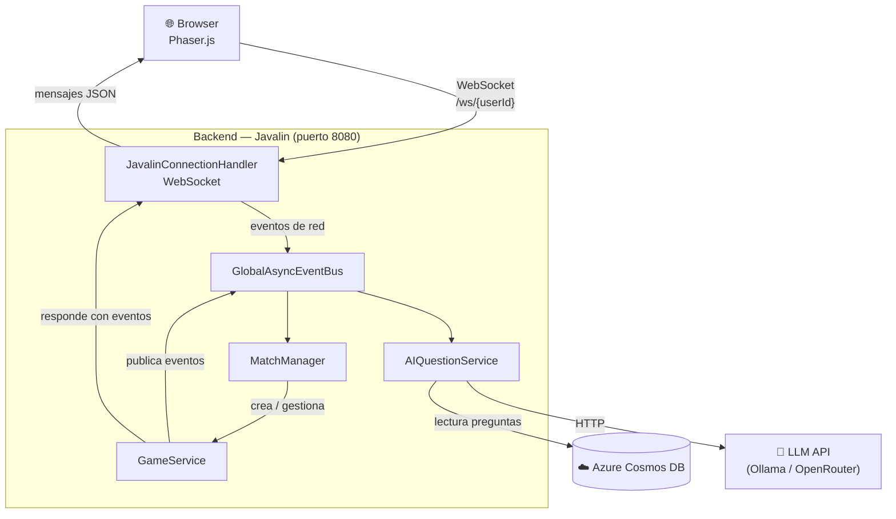
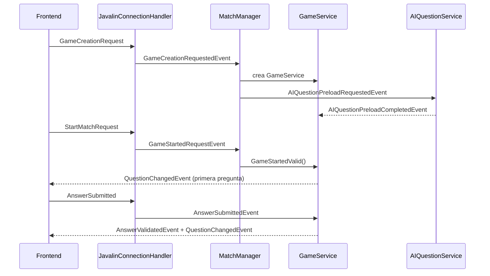
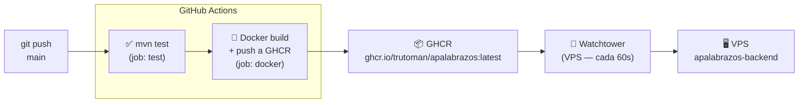

# Apalabrazos

Juego multijugador en tiempo real de tipo "rosco" — los jugadores responden preguntas por cada letra del alfabeto compitiendo contra el tiempo y otros jugadores.

## Stack tecnológico

| Capa | Tecnología | Versión |
|---|---|---|
| Backend | Java + Javalin | 21 / 7.2.0 |
| Frontend | Phaser.js (servido por Javalin) | 3.x |
| Base de datos | Azure Cosmos DB | SDK 4.80.0 |
| Autenticación | JWT (Auth0 java-jwt) | 4.4.0 |
| IA | LLM vía API (Ollama / OpenRouter) | — |
| Contenedor | Docker + Docker Compose | — |
| CI/CD | GitHub Actions + Watchtower | — |

---

## Arquitectura



### Bus de eventos

El backend utiliza un `GlobalAsyncEventBus` como columna vertebral de comunicación interna. Ningún componente llama directamente a otro — todo fluye a través de eventos tipados.



---

## CI/CD



> Si los tests fallan, el job `docker` no se ejecuta y la imagen no se actualiza.

---

## Configuración local

### Requisitos previos

- JDK 21
- Maven 3.9+
- Docker (opcional, para levantar solo el contenedor)

### 1. Clonar y configurar variables

```bash
git clone https://github.com/trutoman/Apalabrazos.git
cd Apalabrazos
cp .env.example .env
# Editar .env con los valores reales
```

### 2. Compilar y ejecutar

```bash
# Compilar
mvn clean package -DskipTests

# Ejecutar directamente con Java
java -cp target/classes:target/dependency/* Apalabrazos.MainApp

# O con Docker
docker build -t apalabrazos .
docker run -p 8080:8080 --env-file .env apalabrazos
```

La aplicación queda disponible en `http://localhost:8080`.

---

## Comandos de desarrollo

```bash
# Tests unitarios
mvn test

# Compilar sin tests
mvn clean package -DskipTests

# Ver logs del contenedor en VPS
docker logs --tail 100 apalabrazos-backend
```

---

## Variables de entorno

Todas las variables necesarias están documentadas en [`.env.example`](.env.example).

Las variables **obligatorias** para arrancar son:

| Variable | Descripción |
|---|---|
| `JWT_SECRET` | Clave de firma de tokens JWT |
| `JWT_ISSUER` | Issuer del token |
| `JWT_AUDIENCE` | Audience del token |
| `COSMOS_DB_ENDPOINT` | URL del endpoint de Cosmos DB |
| `COSMOS_DB_KEY` | Clave de acceso a Cosmos DB |
| `COSMOS_DB_DATABASE` | Nombre de la base de datos |

---

## Despliegue en producción (VPS)

Ver [`docs/VPS_DEPLOY.md`](docs/VPS_DEPLOY.md) para instrucciones completas.

Resumen del flujo:

1. Copiar `docker-compose.prod.yml` y `.env` al VPS.
2. Hacer login en GHCR con un token `read:packages`.
3. `docker compose -f docker-compose.prod.yml up -d`
4. Watchtower se encarga de las actualizaciones automáticas.

---

## Estructura del proyecto

```
src/
├── main/
│   ├── java/Apalabrazos/
│   │   ├── backend/
│   │   │   ├── config/          # JWT, Cosmos DB, IA
│   │   │   ├── events/          # Eventos y buses
│   │   │   ├── model/           # Entidades del dominio
│   │   │   ├── network/         # WebSocket handlers
│   │   │   └── service/         # Lógica de negocio
│   │   └── MainApp.java
│   └── resources/
│       └── public/              # Frontend (HTML + JS + Phaser)
docs/                            # Documentación técnica adicional
.env.example                     # Plantilla de variables de entorno
docker-compose.prod.yml          # Compose para producción
Dockerfile                       # Build multi-stage
```

---

## Documentación técnica

- [Arquitectura detallada](Arquitectura.md)
- [Flujo de generación de preguntas con IA](docs/ai-question-flow.md)
- [Estados de partida](docs/estado-partida-detalle.md)
- [Despliegue en VPS](docs/VPS_DEPLOY.md)
