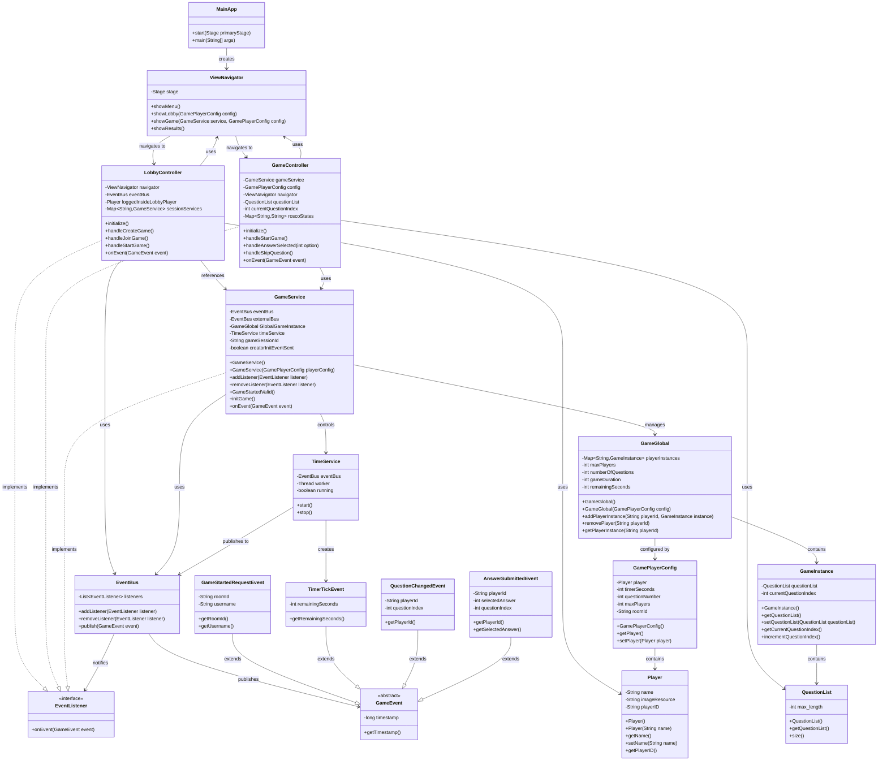

# Diagrama de Clases - Apalabrazos

```mermaid
classDiagram
    %% Main Application
    class MainApp {
        +start(Stage primaryStage)
        +main(String[] args)
    }

    %% Frontend - Controllers
    class ViewNavigator {
        -Stage stage
        +showMenu()
        +showLobby(GamePlayerConfig config)
        +showGame(GameService service, GamePlayerConfig config)
        +showResults()
    }

    class LobbyController {
        -ViewNavigator navigator
        -EventBus eventBus
        -Player loggedInsideLobbyPlayer
        -Map~String,GameService~ sessionServices
        +initialize()
        +handleCreateGame()
        +handleJoinGame()
        +handleStartGame()
        +onEvent(GameEvent event)
    }

    class GameController {
        -GameService gameService
        -GamePlayerConfig config
        -ViewNavigator navigator
        -QuestionList questionList
        -int currentQuestionIndex
        -Map~String,String~ roscoStates
        +initialize()
        +handleStartGame()
        +handleAnswerSelected(int option)
        +handleSkipQuestion()
        +onEvent(GameEvent event)
    }

    %% Backend - Services
    class GameService {
        -EventBus eventBus
        -EventBus externalBus
        -GameGlobal GlobalGameInstance
        -TimeService timeService
        -String gameSessionId
        -boolean creatorInitEventSent
        +GameService()
        +GameService(GamePlayerConfig playerConfig)
        +addListener(EventListener listener)
        +removeListener(EventListener listener)
        +GameStartedValid()
        +initGame()
        +onEvent(GameEvent event)
    }

    class TimeService {
        -EventBus eventBus
        -Thread worker
        -boolean running
        +start()
        +stop()
    }

    %% Backend - Model
    class GameGlobal {
        -Map~String,GameInstance~ playerInstances
        -int maxPlayers
        -int numberOfQuestions
        -int gameDuration
        -int remainingSeconds
        +GameGlobal()
        +GameGlobal(GamePlayerConfig config)
        +addPlayerInstance(String playerId, GameInstance instance)
        +removePlayer(String playerId)
        +getPlayerInstance(String playerId)
    }

    class GameInstance {
        -QuestionList questionList
        -int currentQuestionIndex
        +GameInstance()
        +getQuestionList()
        +setQuestionList(QuestionList questionList)
        +getCurrentQuestionIndex()
        +incrementQuestionIndex()
    }

    class GamePlayerConfig {
        -Player player
        -int timerSeconds
        -int questionNumber
        -int maxPlayers
        -String roomId
        +GamePlayerConfig()
        +getPlayer()
        +setPlayer(Player player)
    }

    class Player {
        -String name
        -String imageResource
        -String playerID
        +Player()
        +Player(String name)
        +getName()
        +setName(String name)
        +getPlayerID()
    }

    class QuestionList {
        -int max_length
        +QuestionList()
        +getQuestionList()
        +size()
    }

    %% Backend - Events
    class EventBus {
        -List~EventListener~ listeners
        +addListener(EventListener listener)
        +removeListener(EventListener listener)
        +publish(GameEvent event)
    }

    class EventListener {
        <<interface>>
        +onEvent(GameEvent event)
    }

    class GameEvent {
        <<abstract>>
        -long timestamp
        +getTimestamp()
    }

    class GameStartedRequestEvent {
        -String roomId
        -String username
        +getRoomId()
        +getUsername()
    }

    class TimerTickEvent {
        -int remainingSeconds
        +getRemainingSeconds()
    }

    class QuestionChangedEvent {
        -String playerId
        -int questionIndex
        +getPlayerId()
    }

    class AnswerSubmittedEvent {
        -String playerId
        -int selectedAnswer
        -int questionIndex
        +getPlayerId()
        +getSelectedAnswer()
    }

    %% Relationships - Main
    MainApp --> ViewNavigator : creates

    %% Relationships - Frontend
    ViewNavigator --> LobbyController : navigates to
    ViewNavigator --> GameController : navigates to

    LobbyController --> ViewNavigator : uses
    LobbyController --> EventBus : uses
    LobbyController --> Player : uses
    LobbyController --> GameService : references
    LobbyController ..|> EventListener : implements

    GameController --> GameService : uses
    GameController --> ViewNavigator : uses
    GameController --> QuestionList : uses
    GameController ..|> EventListener : implements

    %% Relationships - Services
    GameService --> GameGlobal : manages
    GameService --> EventBus : uses
    GameService --> TimeService : controls
    GameService ..|> EventListener : implements

    TimeService --> EventBus : publishes to
    TimeService --> TimerTickEvent : creates

    %% Relationships - Model
    GameGlobal --> GameInstance : contains
    GameGlobal --> GamePlayerConfig : configured by

    GameInstance --> QuestionList : contains

    GamePlayerConfig --> Player : contains

    %% Relationships - Events
    EventBus --> EventListener : notifies
    EventBus --> GameEvent : publishes

    GameStartedRequestEvent --|> GameEvent : extends
    TimerTickEvent --|> GameEvent : extends
    QuestionChangedEvent --|> GameEvent : extends
    AnswerSubmittedEvent --|> GameEvent : extends
```
