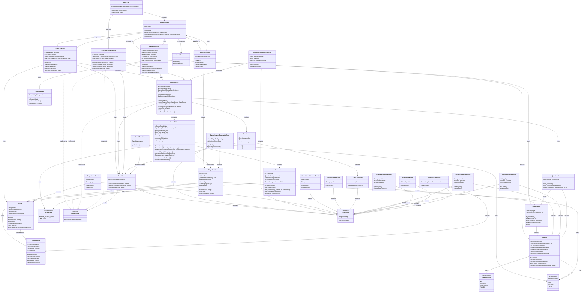

# Diagrama de Clases - Apalabrazos

```mermaid
classDiagram
    %% Main Application
    class MainApp {
        -GameSessionManager gameSessionManager
        +start(Stage primaryStage)
        +main(String[] args)
    }

    %% Frontend - Controllers
    class ViewNavigator {
        -Stage stage
        +showMenu()
        +showLobby(GamePlayerConfig config)
        +showGame(GameService service, GamePlayerConfig config)
        +showResults()
    }

    class MenuController {
        -ViewNavigator navigator
        +initialize()
        +handleJugar()
        +handleMultiplayer()
        +handleExit()
    }

    class LobbyController {
        -ViewNavigator navigator
        -EventBus eventBus
        -Player loggedInsideLobbyPlayer
        -Map~String,GameService~ sessionServices
        +initialize()
        +handleCreateGame()
        +handleJoinGame()
        +handleStartGame()
        +onEvent(GameEvent event)
    }

    class GameController {
        -GameService gameService
        -GamePlayerConfig config
        -ViewNavigator navigator
        -QuestionList questionList
        -int currentQuestionIndex
        -Map~String,String~ roscoStates
        +initialize()
        +handleStartGame()
        +handleAnswerSelected(int option)
        +handleSkipQuestion()
        +onEvent(GameEvent event)
    }

    class ResultsController {
        +initialize()
        +displayResults()
    }

    %% Backend - Services
    class GameService {
        -EventBus eventBus
        -EventBus externalBus
        -GameGlobal GlobalGameInstance
        -TimeService timeService
        -String gameSessionId
        -boolean creatorInitEventSent
        +GameService()
        +GameService(GamePlayerConfig playerConfig)
        +addListener(EventListener listener)
        +removeListener(EventListener listener)
        +GameStartedValid()
        +initGame()
        +onEvent(GameEvent event)
    }

    class GameSessionManager {
        -EventBus eventBus
        -Map~String,GameService~ activeSessions
        -Map~String,String~ sessionCreators
        +addSession(GameService service)
        +removeSession(String sessionId)
        +getSessionById(String sessionId)
        +onEvent(GameEvent event)
    }

    class TimeService {
        -EventBus eventBus
        -Thread worker
        -boolean running
        +start()
        +stop()
    }

    %% Backend - Model
    class GameGlobal {
        <<enumeration>> GameGlobalState
        -Map~String,GameInstance~ playerInstances
        -GameGlobalState state
        -GameType gameType
        -QuestionLevel difficulty
        -int maxPlayers
        -int numberOfQuestions
        -int gameDuration
        -int remainingSeconds
        +GameGlobal()
        +GameGlobal(GamePlayerConfig config)
        +addPlayerInstance(String playerId, GameInstance instance)
        +removePlayer(String playerId)
        +getPlayerInstance(String playerId)
        +setState(GameGlobalState state)
        +transitionControllerReady()
        +transitionStartValidated()
    }

    class GameInstance {
        <<enumeration>> GameState
        -QuestionList questionList
        -GameRecord gameResult
        -int currentQuestionIndex
        -GameState gameInstanceState
        +GameInstance()
        +getQuestionList()
        +setQuestionList(QuestionList questionList)
        +getCurrentQuestionIndex()
        +incrementQuestionIndex()
    }

    class GamePlayerConfig {
        -Player player
        -int timerSeconds
        -QuestionLevel difficultyLevel
        -int questionNumber
        -int maxPlayers
        -GameType gameType
        -String roomId
        +GamePlayerConfig()
        +getPlayer()
        +setPlayer(Player player)
    }

    class Player {
        -String name
        -String imageResource
        -String playerID
        -List~GameRecord~ history
        +Player()
        +Player(String name)
        +getName()
        +setName(String name)
        +getPlayerID()
        +addGameResult(GameRecord result)
    }

    class GameRecord {
        -int correctAnswers
        -int incorrectAnswers
        -int passedQuestions
        -int totalTime
        +GameRecord()
        +getCorrectAnswers()
        +getTotalAnswered()
        +incrementCorrect()
        +incrementIncorrect()
    }

    class Question {
        -String questionText
        -List~String~ questionResponsesList
        -int correctQuestionIndex
        -QuestionStatus questionStatus
        -QuestionLevel questionLevel
        -String questionLetter
        -String userResponseRecorded
        +Question()
        +getQuestionText()
        +getQuestionResponsesList()
        +getCorrectQuestionIndex()
        +setQuestionStatus(QuestionStatus status)
    }

    class QuestionList {
        -int max_length
        -List~Question~ questionList
        +QuestionList()
        +getQuestionList()
        +addQuestion(Question q)
        +getQuestionAt(int index)
        +size()
    }

    class QuestionLevel {
        <<enumeration>>
        EASY
        MEDIUM
        HARD
    }

    class QuestionStatus {
        <<enumeration>>
        INIT
        CORRECT
        INCORRECT
        PASSED
    }

    class GameType {
        <<enumeration>>
        HIGHER_POINTS_WINS
        TIME_TRIAL
    }

    class AlphabetMap {
        -Map~String,String~ letterMap
        +AlphabetMap()
        +getLetter(int index)
        +getIndex(String letter)
    }

    %% Backend - Events
    class EventBus {
        -List~EventListener~ listeners
        +addListener(EventListener listener)
        +removeListener(EventListener listener)
        +publish(GameEvent event)
    }

    class GlobalEventBus {
        -EventBus instance
        +getInstance()
    }

    class EventListener {
        <<interface>>
        +onEvent(GameEvent event)
    }

    class GameEvent {
        <<abstract>>
        -long timestamp
        +getTimestamp()
    }

    class GameCreationRequestedEvent {
        -GamePlayerConfig config
        -String tempRoomCode
        +getConfig()
        +getTempRoomCode()
    }

    class GameSessionCreatedEvent {
        -String tempRoomCode
        -String sessionId
        -GameService gameService
        +getSessionId()
        +getGameService()
    }

    class PlayerJoinedEvent {
        -String roomId
        -Player player
        +getRoomId()
        +getPlayer()
    }

    class GameStartedRequestEvent {
        -String roomId
        -String username
        +getRoomId()
        +getUsername()
    }

    class CreatorInitGameEvent {
        -String playerId
        +getPlayerId()
    }

    class TimerTickEvent {
        -int remainingSeconds
        +getRemainingSeconds()
    }

    class QuestionChangedEvent {
        -String playerId
        -Question question
        -int questionIndex
        +getPlayerId()
        +getQuestion()
    }

    class AnswerSubmittedEvent {
        -String playerId
        -int selectedAnswer
        -int questionIndex
        +getPlayerId()
        +getSelectedAnswer()
    }

    class AnswerValidatedEvent {
        -String playerId
        -boolean isCorrect
        -Question question
        +isCorrect()
        +getQuestion()
    }

    class TurnEndedEvent {
        -String playerId
        +getPlayerId()
    }

    class GameFinishedEvent {
        -Map~String,GameRecord~ results
        +getResults()
    }

    %% Backend - Tools
    class QuestionFileLoader {
        -String defaultQuestionsFile
        +loadQuestions()
        +loadQuestions(String filePath)
        +selectQuestionByLetter(QuestionList all)
    }

    %% Relationships - Main
    MainApp --> GameSessionManager : manages
    MainApp --> ViewNavigator : creates

    %% Relationships - Frontend
    ViewNavigator --> MenuController : navigates to
    ViewNavigator --> LobbyController : navigates to
    ViewNavigator --> GameController : navigates to
    ViewNavigator --> ResultsController : navigates to

    MenuController --> ViewNavigator : uses
    MenuController --> GamePlayerConfig : creates

    LobbyController --> ViewNavigator : uses
    LobbyController --> EventBus : uses
    LobbyController --> Player : uses
    LobbyController --> GameService : references
    LobbyController ..|> EventListener : implements

    GameController --> GameService : uses
    GameController --> ViewNavigator : uses
    GameController --> QuestionList : uses
    GameController --> Question : displays
    GameController --> AlphabetMap : uses
    GameController ..|> EventListener : implements

    %% Relationships - Services
    GameService --> GameGlobal : manages
    GameService --> EventBus : uses
    GameService --> TimeService : controls
    GameService --> QuestionFileLoader : uses
    GameService ..|> EventListener : implements

    GameSessionManager --> EventBus : uses
    GameSessionManager --> GameService : manages
    GameSessionManager ..|> EventListener : implements

    TimeService --> EventBus : publishes to
    TimeService --> TimerTickEvent : creates

    %% Relationships - Model
    GameGlobal --> GameInstance : contains
    GameGlobal --> GamePlayerConfig : configured by
    GameGlobal --> GameType : uses
    GameGlobal --> QuestionLevel : uses

    GameInstance --> QuestionList : contains
    GameInstance --> GameRecord : tracks

    GamePlayerConfig --> Player : contains
    GamePlayerConfig --> QuestionLevel : uses
    GamePlayerConfig --> GameType : uses

    Player --> GameRecord : has history of

    QuestionList --> Question : contains
    Question --> QuestionStatus : has
    Question --> QuestionLevel : has

    %% Relationships - Events
    GlobalEventBus --> EventBus : provides singleton
    EventBus --> EventListener : notifies
    EventBus --> GameEvent : publishes

    GameCreationRequestedEvent --|> GameEvent : extends
    GameSessionCreatedEvent --|> GameEvent : extends
    PlayerJoinedEvent --|> GameEvent : extends
    GameStartedRequestEvent --|> GameEvent : extends
    CreatorInitGameEvent --|> GameEvent : extends
    TimerTickEvent --|> GameEvent : extends
    QuestionChangedEvent --|> GameEvent : extends
    AnswerSubmittedEvent --|> GameEvent : extends
    AnswerValidatedEvent --|> GameEvent : extends
    TurnEndedEvent --|> GameEvent : extends
    GameFinishedEvent --|> GameEvent : extends

    GameCreationRequestedEvent --> GamePlayerConfig : contains
    GameSessionCreatedEvent --> GameService : references
    PlayerJoinedEvent --> Player : contains
    QuestionChangedEvent --> Question : contains
    AnswerValidatedEvent --> Question : contains
    GameFinishedEvent --> GameRecord : contains

    %% Tools
    QuestionFileLoader --> QuestionList : loads
    QuestionFileLoader --> Question : creates
```
