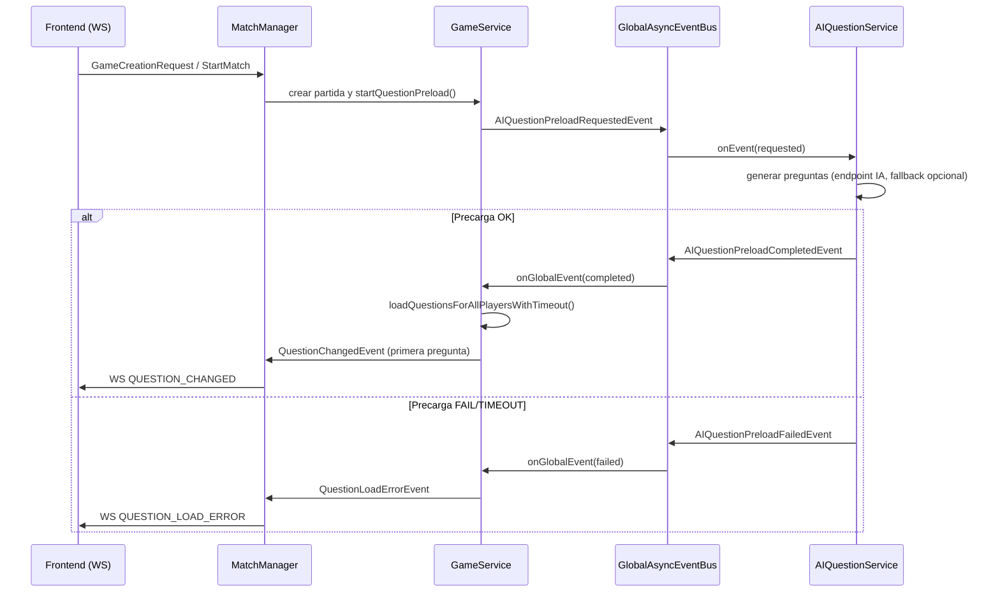

# Flujo de Preguntas IA (nuevo)

## Objetivo

Documentar el flujo actual para precarga de preguntas al crear/iniciar partida, usando el bus de eventos global y el bridge a WebSocket.

## Diagrama secuencial (corto)

## Tabla de eventos

| Evento | Emisor | Receptor | Payload principal |
|---|---|---|---|
| `AIQuestionPreloadRequestedEvent` | `GameService.startQuestionPreload()` | `AIQuestionService` (vía `GlobalAsyncEventBus`) | `matchId`, `numberOfQuestions`, `allowFallback` |
| `AIQuestionPreloadCompletedEvent` | `AIQuestionService` | `GameService` (vía `GlobalAsyncEventBus`) | `matchId`, `questions` (`QuestionList`), `source` |
| `AIQuestionPreloadFailedEvent` | `AIQuestionService` | `GameService` (vía `GlobalAsyncEventBus`) | `matchId`, `errorMessage`, `errorReason` |
| `QuestionChangedEvent` | `GameService` (bus externo de partida) | `MatchManager` (network bridge) | `questionIndex`, `status`, `playerId` (opcional), `nextQuestion`, `totalCorrect`, `totalIncorrect` |
| `WS QUESTION_CHANGED` | `MatchManager.sendQuestionChangedToPlayers()` | Frontend (`message-handler.js`) | `payload.roomId`, `payload.questionIndex`, `payload.status`, `payload.nextQuestion`, `payload.totalCorrect`, `payload.totalIncorrect` |
| `QuestionLoadErrorEvent` | `GameService` (cuando hay timeout/error al cargar) | `MatchManager` (network bridge) | `matchId`, `errorMessage`, `errorReason` |
| `WS QUESTION_LOAD_ERROR` | `MatchManager.sendQuestionLoadErrorToPlayers()` | Frontend (`message-handler.js`) | `payload.roomId`, `payload.errorMessage`, `payload.errorReason` |

## Notas rápidas

- `errorReason` esperado: `TIMEOUT`, `LOAD_FAILED` (y compatibles futuros).
- El frontend filtra por sala activa antes de actuar sobre el evento.
- En error de carga, el frontend muestra modal explícito de cancelación y vuelve al lobby.