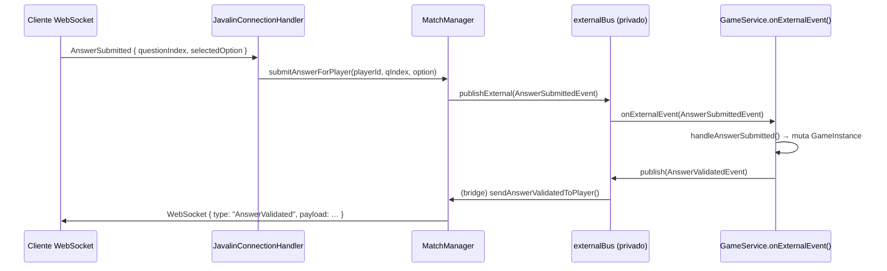
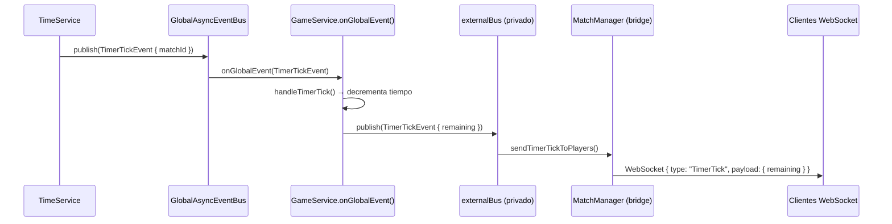

# Arquitectura de doble bus en `GameService`

## Resumen

`GameService` utiliza **dos buses de eventos independientes** para gestionar la lógica de una partida. Esta separación resuelve tres problemas concretos: evita bucles de retroalimentación, aísla los eventos de cada partida y define con claridad qué capa habla con quién.

---

## Los dos buses

| | Bus global (`eventBus`) | Bus externo (`externalBus`) |
|---|---|---|
| **Tipo** | `AsyncEventBus` singleton (`GlobalAsyncEventBus`) | `AsyncEventBus` nueva instancia por partida |
| **Compartido entre partidas** | Sí | No — es privado de cada `GameService` |
| **Quién publica en él** | `MatchManager`, `TimeService` y otros servicios de backend | `MatchManager` (comandos del controlador) y el propio `GameService` (actualizaciones de estado) |
| **Quién escucha** | `GameService.globalListener` → `onGlobalEvent()` | `GameService.externalListener` → `onExternalEvent()` y `MatchManager` (bridge de red) |
| **Eventos típicos recibidos** | `PlayerJoinedEvent`, `TimerTickEvent`, `GameControllerReady` (desde infraestructura) | `GameControllerReady`, `AnswerSubmittedEvent` (desde `MatchManager`) |
| **Eventos típicos publicados** | — | `TimerTickEvent`, `AnswerValidatedEvent`, `QuestionChangedEvent`, `CreatorInitGameEvent`, `GameFinishedEvent` |

---

## ¿Por qué separar dos buses?

### 1. Evitar bucles de retroalimentación

Si `GameService` publicase y escuchase en el **mismo** bus global, los eventos que él mismo produce podrían volver a disparar su propio handler. El ejemplo más claro es `TimerTickEvent`:

```
TimeService  →  GlobalAsyncEventBus  →  GameService.onGlobalEvent()
                                              ↓ procesa tick
                                         publica TimerTickEvent actualizado
                                              ↓
                               GlobalAsyncEventBus  →  ¡bucle!
```

Con la separación, `GameService` publica el tick procesado en el **bus externo**, que solo escucha `MatchManager`. El bus global nunca ve ese evento de vuelta.

> Por este motivo, `onExternalEvent()` contiene este guard explícito:
> ```java
> } else if (event instanceof TimerTickEvent) {
>     // No reenviar TimerTickEvent al mismo bus para evitar bucles
>     return;
> }
> ```

### 2. Separación de responsabilidades

- El **bus global** es de coordinación interna de backend: conecta `MatchManager`, `TimeService` y `GameService` a nivel de infraestructura.
- El **bus externo** es la interfaz de contrato entre `GameService` y el controlador de red (`MatchManager`): recibe comandos de los clientes y emite actualizaciones que se transforman en mensajes WebSocket.

### 3. Aislamiento por partida

Cada `GameService` crea su propia instancia de `AsyncEventBus` al construirse:

```java
this.externalBus = new AsyncEventBus();
```

Esto garantiza que los eventos de la partida A nunca llegan a los listeners de la partida B.

---

## Routing interno paso a paso

```
┌─────────────────────────────────────────────────────────────────────┐
│                         GameService                                 │
│                                                                     │
│  GlobalAsyncEventBus ──► globalListener ──► onGlobalEvent()         │
│      (singleton)                              │                     │
│                                               ├─ PlayerJoinedEvent  │
│                                               ├─ TimerTickEvent     │
│                                               └─ GameControllerReady│
│                                                                     │
│  externalBus (privado) ──► externalListener ──► onExternalEvent()   │
│                                               │                     │
│                                               ├─ GameControllerReady│
│                                               └─ AnswerSubmittedEvent│
│                                                                     │
│  GameService ──publish──► externalBus ──► MatchManager (bridge)     │
│                                               │                     │
│                                               ├─ TimerTickEvent     │
│                                               ├─ AnswerValidatedEvent│
│                                               ├─ QuestionChangedEvent│
│                                               ├─ CreatorInitGameEvent│
│                                               └─ GameFinishedEvent  │
└─────────────────────────────────────────────────────────────────────┘
```

---

## Flujo completo de un evento: `AnswerSubmitted`



---

## Flujo completo de un evento: `TimerTick`



> Nótese que el `TimerTickEvent` publicado en `externalBus` **no** regresa a `onGlobalEvent()` porque el bus global y el externo son instancias distintas.

---

## Flujo de inicialización: `GameControllerReady`

El evento `GameControllerReady` puede llegar por cualquiera de los dos caminos:

| Camino | Bus | Handler |
|---|---|---|
| Infraestructura de backend | `GlobalAsyncEventBus` | `onGlobalEvent()` |
| `MatchManager.markMatchControllerReady()` | `externalBus` | `onExternalEvent()` |

Ambos handlers llaman a `GlobalGameInstance.transitionControllerReady(playerId)` y luego a `checkAndInitialize()`. En la práctica, `MatchManager` siempre publica a través del bus externo; el handler del bus global actúa como salvaguarda de compatibilidad.

---

## Implementación de los listeners separados

```java
// GameService.java — campos de instancia
private final EventListener globalListener = this::onGlobalEvent;
private final EventListener externalListener = this::onExternalEvent;

// Constructor
eventBus.addListener(globalListener);   // bus global → onGlobalEvent
externalBus.addListener(externalListener); // bus externo → onExternalEvent
```

Usar referencias de método distintas (en vez de registrar `this` en ambos buses) es lo que impide que un evento publicado en el bus externo active el handler del bus global y viceversa.

---

## Resumen de responsabilidades

| Método | Bus de origen | Qué hace |
|---|---|---|
| `onGlobalEvent(GameEvent)` | `GlobalAsyncEventBus` | Reacciona a eventos de infraestructura compartida |
| `onExternalEvent(GameEvent)` | `externalBus` | Reacciona a comandos del controlador de red |
| `publishExternal(GameEvent)` | `externalBus` | Emite actualizaciones de estado hacia `MatchManager` |
| `publishExternalAndWait(GameEvent)` | `externalBus` | Igual que el anterior pero bloqueante (garantías de orden) |
| `getExternalBus()` | — | Expone el bus externo para que `MatchManager` pueda suscribirse al crear el bridge de red |

---

## Archivos fuente clave

- `src/main/java/Apalabrazos/backend/service/GameService.java` — implementación completa del doble bus
- `src/main/java/Apalabrazos/backend/events/AsyncEventBus.java` — bus asíncrono con Virtual Threads
- `src/main/java/Apalabrazos/backend/events/GlobalAsyncEventBus.java` — singleton global
- `src/main/java/Apalabrazos/backend/service/MatchManager.java` — bridge de red (suscriptor del bus externo)
- `src/main/java/Apalabrazos/backend/service/TimeService.java` — publica `TimerTickEvent` en el bus global
