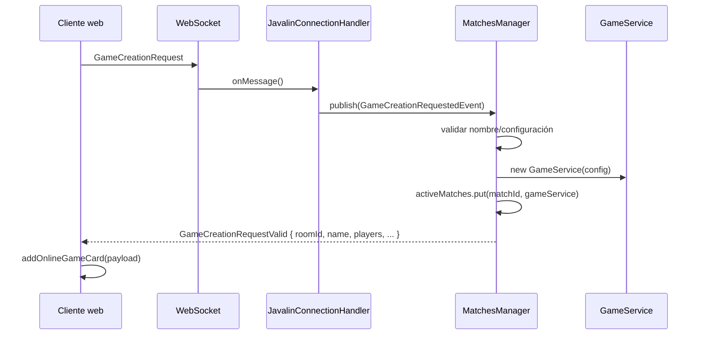

# Flujo de creación de una partida en `Apalabrazos`

## Objetivo
Este documento resume **qué ocurre exactamente cuando se crea una partida** en la aplicación, poniendo especial énfasis en:

1. **Cómo se gestionan los usuarios** conectados y los jugadores dentro de una partida.
2. **Cómo el cliente web puede ver** las partidas creadas en la instancia activa del backend.

---

## Resumen ejecutivo
La gestión de partidas y usuarios gira alrededor de tres estructuras en memoria:

| Nivel | Clase | Qué guarda |
|---|---|---|
| Conexiones WebSocket | `MatchesManager.activeConnections` | Usuarios conectados al backend (`sessionId -> Player`) |
| Lobby global | `LobbyRoom.sessions` | Sesiones que están dentro del lobby |
| Partidas activas | `MatchesManager.activeMatches` | Partidas activas (`matchId -> GameService`) |

La **fuente de verdad de las partidas vivas** está en el singleton `MatchesManager`.

> Importante: las partidas activas están **en memoria del backend**, no persistidas en base de datos. Si se reinicia el proceso, ese estado se pierde.

---

## Componentes implicados

### Backend
- `src/main/java/Apalabrazos/backend/network/server/EmbeddedWebSocketServer.java`
  - Arranca Javalin, registra `/api/login`, `/api/register` y `/ws/game/{userId}`.
- `src/main/java/Apalabrazos/backend/network/server/JavalinConnectionHandler.java`
  - Valida el WebSocket y procesa mensajes como `GameCreationRequest`.
- `src/main/java/Apalabrazos/backend/network/ConnectionHandler.java`
  - Crea el objeto `Player`, lo registra y lo mete al lobby.
- `src/main/java/Apalabrazos/backend/service/MatchesManager.java`
  - Orquesta usuarios conectados y partidas activas.
- `src/main/java/Apalabrazos/backend/service/GameService.java`
  - Contiene la lógica viva de una partida concreta.
- `src/main/java/Apalabrazos/backend/model/GameGlobal.java`
  - Mantiene el mapa de jugadores dentro de una partida (`playerInstances`).
- `src/main/java/Apalabrazos/backend/lobby/LobbyRoom.java`
  - Representa el lobby global y difunde mensajes de chat.

### Frontend
- `src/main/resources/public/js/main.js`
  - Login, conexión WebSocket, creación visual de tarjetas de partidas.
- `src/main/resources/public/js/network/socket-client.js`
  - Cliente WebSocket del navegador.
- `src/main/resources/public/index.html`
  - Vista de lobby y contenedor `#games-list`.

---

## 1) Entrada del usuario al sistema
Antes de crear una partida, el usuario pasa por este flujo:

1. Hace `POST /api/login`.
2. El backend devuelve un **JWT** si las credenciales son válidas.
3. El navegador abre un WebSocket hacia:
   ```text
   /ws/game/{userId}?token=...
   ```
4. `JavalinConnectionHandler.onConnect()` valida que:
   - exista token,
   - el token sea correcto,
   - el `userId` de la URL coincida con el del JWT.
5. Si todo va bien, `ConnectionHandler.onClientConnect()`:
   - genera un `sessionId` (`UUID`),
   - crea un `WebSocketMessageSender`,
   - crea un objeto `Player(sessionId, username, cosmosUserId, sender)`,
   - registra ese `Player` en `MatchesManager.activeConnections`,
   - añade la sesión al `LobbyRoom`.

### Resultado práctico
En este punto el backend ya sabe:
- **quién es el usuario** (`username`, `cosmosUserId`),
- **qué conexión física tiene** (`sessionId`),
- y que está en el **lobby global**.

---

## 2) Qué envía el cliente cuando el usuario crea una partida
En `main.js`, al pulsar `Create Game`:

1. Se ejecuta `validate_game_creation()`.
2. Si la validación pasa, se construye un payload como este:

```json
{
  "name": "Mi partida",
  "players": 2,
  "gameType": "classic",
  "time": 5,
  "difficulty": "medium",
  "requestedAt": 1710000000
}
```

3. Ese payload se manda por WebSocket con:

```js
SocketClient.send('GameCreationRequest', payload)
```

---

## 3) Cómo procesa el backend la creación de la partida
Cuando el servidor recibe ese mensaje, `JavalinConnectionHandler.onMessage()`:

1. Recupera la sesión WebSocket (`session-uuid`).
2. Localiza el `Player` correspondiente con `sessionManager.getPlayerBySessionId(sessionId)`.
3. Extrae los datos del mensaje JSON.
4. Convierte esos datos a `GamePlayerConfig`.
5. Publica un evento:

```java
new GameCreationRequestedEvent(config, gameName)
```

Ese evento lo consume `MatchesManager`.

---

## 4) Validación y alta de la partida en memoria
La creación real ocurre en `MatchesManager.handleGameCreationRequested()`.

### Validaciones aplicadas
El backend vuelve a validar que:
- el nombre exista y tenga formato correcto,
- el nombre no esté repetido,
- el número de jugadores esté entre **2 y 8**,
- el tiempo esté dentro de los valores admitidos,
- haya dificultad y tipo de juego válidos.

Si falla algo, el creador recibe por WebSocket:

```json
{
  "type": "GameCreationRequestInvalid",
  "payload": {
    "cause": "..."
  }
}
```

### Si la validación es correcta
Se hace lo siguiente:

1. Se crea un `GameService` nuevo para esa partida.
2. Se asigna el creador:
   - `gameService.setCreatorPlayerId(player.getPlayerID())`
3. Se guarda el nombre de la partida:
   - `gameService.setGameName(tempRoomCode)`
4. Se genera un `matchId` aleatorio y se registra la partida en:
   - `MatchesManager.activeMatches`

En otras palabras, la partida queda accesible en memoria así:

```text
matchId -> GameService -> GameGlobal -> playerInstances
```

---

## 5) Qué recibe el cliente cuando la partida se crea bien
Si todo sale bien, el backend responde **solo al creador** con un mensaje tipo:

```json
{
  "type": "GameCreationRequestValid",
  "payload": {
    "roomId": "Ab12Cd34",
    "name": "Mi partida",
    "players": 1,
    "maxPlayers": 2,
    "gameType": "HIGHER_POINTS_WINS",
    "time": 5,
    "difficulty": "MEDIUM"
  }
}
```

En `main.js`, el cliente escucha ese mensaje y llama a:

```js
addOnlineGameCard(payload)
```

Eso inserta una tarjeta HTML en `#games-list`, que es la lista visible de partidas online del lobby.

---

## 6) Cómo se gestionan los usuarios de una partida
Aquí está la parte clave.

### 6.1 Usuario conectado ≠ jugador ya metido en una partida
En este proyecto, un usuario puede existir en varios niveles:

| Nivel | Representación |
|---|---|
| Usuario conectado al backend | `Player` |
| Usuario presente en el lobby | `sessionId` dentro de `LobbyRoom.sessions` |
| Jugador realmente metido en una partida | entrada en `GameGlobal.playerInstances` |

Esto significa que **estar conectado al lobby no implica estar ya dentro de una partida**.

---

### 6.2 El objeto `Player` es el ancla del usuario
`Player` guarda datos importantes del usuario conectado:
- `sessionId`: identifica la conexión WebSocket,
- `name`: nombre visible,
- `playerID`: identificador lógico del jugador,
- `cosmosUserId`: id persistente del usuario en Cosmos,
- `sender`: canal para enviar mensajes al navegador,
- `state`: estado lógico (`LOBBY`, `PLAYING`, `DISCONNECTED`, etc.).

Por eso `MatchesManager.activeConnections` funciona como el **registro general de usuarios conectados**.

---

### 6.3 Los jugadores de una partida se guardan dentro de `GameGlobal`
Cada `GameService` tiene un `GameGlobal`, y `GameGlobal` mantiene:

```java
Map<String, GameInstance> playerInstances
```

La clave es `playerId`, y el valor es una `GameInstance` individual para ese jugador.

Cada `GameInstance` representa el estado particular de ese jugador dentro de la partida:
- preguntas cargadas,
- progreso,
- aciertos / fallos,
- estado local (`PENDING`, `PLAYING`, etc.).

---

### 6.4 Cómo entra realmente un jugador en una partida
Cuando llega un `PlayerJoinedEvent(playerId, roomCode)`, `MatchesManager.handlePlayerJoined()`:

1. busca el `GameService` por `roomId`,
2. comprueba si el jugador ya está en esa partida,
3. llama a `service.addPlayerToGame(playerId)`.

Y `GameService.addPlayerToGame()`:
- rechaza `playerId` nulo o vacío,
- evita duplicados,
- evita sobrepasar `maxPlayers`,
- crea una nueva `GameInstance` para ese jugador,
- mete esa instancia en `GameGlobal.playerInstances`.

### Consecuencia
El número real de jugadores de una partida sale de:

```java
GameGlobal.getPlayerCount()
```

y eso cuenta cuántas entradas hay en `playerInstances`.

---

### 6.5 Detalle importante sobre el creador de la partida
Hay un matiz relevante en el código actual:

- al crear la partida, el backend **marca quién es el creador** (`creatorPlayerId`),
- y al cliente le devuelve `players = 1`,
- **pero el creador no se inserta automáticamente en `playerInstances` dentro de `GameGlobal` en ese mismo punto**.

Es decir:
- **a nivel de UI/lobby**, el creador ya cuenta como presente,
- **a nivel interno de `GameGlobal`**, el alta efectiva del jugador ocurre cuando se publica y procesa `PlayerJoinedEvent`.

Esto explica por qué en el código aparece el comentario de que el creador “cuenta como jugador conectado en lobby”, aunque el almacenamiento real de jugadores por partida se hace en otra capa.

---

### 6.6 Qué pasa si un usuario se desconecta
Cuando el WebSocket se cierra:

1. `ConnectionHandler.onClientDisconnect()` llama a `MatchesManager.unregisterConnection(sessionId)`.
2. Ese método elimina al usuario de `activeConnections`.
3. Además, `LobbyRoom.leave(sessionId)` lo saca del lobby global.

> En el código revisado no se ve una limpieza automática del jugador dentro de `GameGlobal.playerInstances` al desconectarse. La desconexión quita la conexión activa y lo saca del lobby, pero no necesariamente borra su estado lógico de una partida ya creada.

---

## 7) Cómo puede el cliente web ver las partidas creadas en la instancia del backend

## Respuesta corta
**Ahora mismo las partidas activas viven en `MatchesManager.activeMatches`, pero el cliente web no tiene una sincronización global completa con esa lista.**

### Lo que sí pasa hoy
Cuando un usuario crea una partida correctamente:
- el backend la registra en `activeMatches`,
- y devuelve `GameCreationRequestValid` al creador,
- el creador añade esa partida visualmente al lobby con `addOnlineGameCard()`.

### Lo que no aparece implementado todavía
No se aprecia en el código revisado:
- un endpoint REST para pedir `getActiveMatches()`,
- un mensaje WebSocket que difunda a **todos** los clientes la lista completa de partidas,
- una sincronización inicial del lobby al entrar,
- un manejador JS funcional para el botón `Join` de las tarjetas.

### Implicación real
La **instancia de backend sí conoce** todas las partidas creadas porque las guarda en:

```java
MatchesManager.activeMatches
```

pero el **cliente web solo ve las partidas que le llegan por mensaje** y, con el estado actual del código, eso ocurre principalmente cuando:
- el propio cliente ha creado la partida, o
- se añadiese manualmente una difusión que hoy no está cableada de extremo a extremo.

---

## 8) Flujo completo resumido



---

## 9) Conclusión

### Lo más importante
- Las partidas creadas se almacenan en memoria dentro de `MatchesManager.activeMatches`.
- Los usuarios conectados se controlan en `MatchesManager.activeConnections`.
- Los jugadores reales de cada partida se guardan en `GameGlobal.playerInstances`.
- El cliente web muestra partidas en el lobby cuando recibe `GameCreationRequestValid` y añade una tarjeta al DOM.

### Estado actual del proyecto
El sistema **ya crea y registra partidas correctamente en backend**, pero la **visualización global de partidas para todos los clientes aún no está cerrada del todo**. Falta una publicación/sincronización explícita de `activeMatches` hacia el lobby web.

---

## 10) Mejora recomendada si quieres que todos vean todas las partidas
Para que cualquier cliente vea las partidas creadas en la instancia del backend al entrar al lobby, lo ideal sería implementar una de estas dos opciones:

1. **Snapshot inicial al conectar al lobby**
   - al autenticarse, el backend envía la lista de `getActiveMatches()`.

2. **Broadcast en tiempo real**
   - cuando se crea una partida, el backend manda un evento a todos los usuarios del `LobbyRoom`.

La combinación de ambas suele ser lo más robusto:
- **snapshot al entrar**,
- **broadcast cuando haya cambios**.
